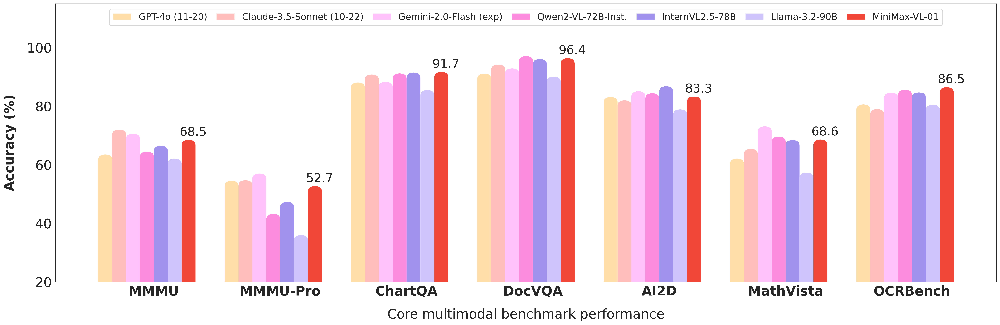

<div align="center">
  
</div>
<hr>

<div align="center" style="line-height: 1;">
  <a href="https://www.minimaxi.com/en" target="_blank" style="margin: 2px;">
    
  </a>
  <a href="https://huggingface.co/MiniMaxAI" target="_blank" style="margin: 2px;">
    
  </a>
</div>
<div align="center" style="line-height: 1;">
  <a href="https://www.hailuo.ai/" target="_blank" style="margin: 2px;">
    
  </a>
  <a href="https://intl.minimaxi.com" style="margin: 2px;">
    
  </a>
</div>
<div align="center" style="line-height: 1;">
  <a href="https://github.com/MiniMax-AI/MiniMax-01/blob/main/LICENSE" style="margin: 2px;">
    
  </a>
</div>

# MiniMax-VL-01

## 1. Introduction
We are delighted to introduce our **MiniMax-VL-01** model. It adopts the “ViT-MLP-LLM” framework, which is a commonly used technique in the field of multimodal large language models. The model is initialized and trained with three key parts: a 303-million-parameter Vision Transformer (ViT) for visual encoding, a randomly initialized two-layer MLP projector for image adaptation, and the MiniMax-Text-01 as the base LLM.
MiniMax-VL-01 has a notable dynamic resolution feature. Input images are resized per a pre-set grid, with resolutions from 336×336 to 2016×2016, keeping a 336×336 thumbnail. The resized images are split into non-overlapping patches of the same size. These patches and the thumbnail are encoded separately and then combined for a full image representation.
The training data for MiniMax-VL-01 consists of caption, description, and instruction data. The Vision Transformer (ViT) is trained on 694 million image-caption pairs from scratch. Across four distinct stages of the training pipeline, a total of 512 billion tokens are processed, leveraging this vast amount of data to endow the model with strong capabilities.
Finally, MiniMax-VL-01 has reached top-level performance on multimodal leaderboards, demonstrating its edge and dependability in complex multimodal tasks.


<p align="center">
  
</p>


## 2. Evaluation

| Tasks | GPT-4o<br>(11-20) | Claude-3.5-Sonnet (10-22) | Gemini-1.5-Pro (002) | Gemini-2.0-Flash (exp) | Qwen2-VL-72B-Inst. | InternVL2.5-78B | LLama-3.2-90B | MiniMax-VL-01 |
| ---- | ---- | ---- | ---- | ---- | ---- | ---- | ---- | ---- |
| **Knowledge** |  |  |  |  |  |  |  |  |
| MMMU<sup>*</sup> | 63.5 | **72.0** | 68.4  | 70.6  | 64.5 | 66.5 | 62.1 | 68.5 |
| MMMU-Pro<sup>*</sup>  |  54.5 | 54.7 | 50.9 | **57.0**  | 43.2 | 47.3 | 36.0 | 52.7 |
| **Visual Q&A** |  |  |  |  |  |  |  |  |
| ChartQA<sup>*</sup><sub>relaxed</sub> | 88.1 | 90.8 | 88.7 | 88.3 | 91.2 | 91.5 | 85.5 | **91.7** |
| DocVQA<sup>*</sup>  | 91.1 | 94.2 | 91.5 | 92.9 | **97.1** | 96.1 | 90.1 | 96.4 |
| OCRBench | 806 | 790 | 800 | 846  | 856 | 847 | 805 | **865** |
| **Mathematics & Sciences** ||  |  |  |  |  |  |  |
| AI2D<sup>*</sup> | 83.1 | 82.0 | 80.9 | 85.1 | 84.4 | **86.8** | 78.9 | 83.3 |
| MathVista<sup>*</sup>  | 62.1 | 65.4 | 70.6 | **73.1** | 69.6 | 68.4 | 57.3 | 68.6 |
| OlympiadBench<sub>full</sub> | 25.2 | 28.4 | 32.1 | **46.1** | 21.9 | 25.1 | 19.3 | 24.2 |
|**Long Context**|||||
|M-LongDoc<sub>acc</sub>| **41.4** | 31.4 | 26.2 | 31.4 | 11.6 | 19.7 | 13.9 | 32.5 |
|**Comprehensive**|||||
|MEGA-Bench<sub>macro</sub> | 49.4 | 51.4 | 45.9 | **53.9** | 46.8 | 45.3 | 19.9 | 47.4 |
|**User Experience**|||||
|In-house Benchmark | 62.3 | 47.0 | 49.2 | **72.1** | 40.6 | 34.8 | 13.6 | 56.6 |

<sup>*</sup> Evaluated following a _0-shot CoT_ setting.


## 3. Quickstart
Here we provide a simple example of loading the tokenizer and model to generate content.
```python
from transformers import AutoModelForCausalLM, AutoProcessor, AutoConfig, QuantoConfig, GenerationConfig
import torch
import json
import os
from PIL import Image

# load hf config
hf_config = AutoConfig.from_pretrained("MiniMax-VL-01", trust_remote_code=True)

# quantization config, int8 is recommended
quantization_config =  QuantoConfig(
            weights="int8",
            modules_to_not_convert=[
                "vision_tower",
                "image_newline",
                "multi_modal_projector",
                "lm_head",
                "embed_tokens",
            ] + [f"model.layers.{i}.coefficient" for i in range(hf_config.text_config.num_hidden_layers)]
            + [f"model.layers.{i}.block_sparse_moe.gate" for i in range(hf_config.text_config.num_hidden_layers)]
        )

# set device map
model_safetensors_index_path = os.path.join("MiniMax-VL-01", "model.safetensors.index.json")
with open(model_safetensors_index_path, "r") as f:
    model_safetensors_index = json.load(f)
weight_map = model_safetensors_index['weight_map']
vision_map = {}
for key, value in weight_map.items():
    if 'vision_tower' in key or 'image_newline' in key or 'multi_modal_projector' in key:
        new_key = key.replace('.weight','').replace('.bias','')
        if new_key not in vision_map:
            vision_map[new_key] = value
# assume 8 GPUs
world_size = 8
device_map = {
    'language_model.model.embed_tokens': 'cuda:0',
    'language_model.model.norm': f'cuda:{world_size - 1}',
    'language_model.lm_head': f'cuda:{world_size - 1}'
}
for key, value in vision_map.items():
    device_map[key] = f'cuda:0'
device_map['vision_tower.vision_model.post_layernorm'] = f'cuda:0'
layers_per_device = hf_config.text_config.num_hidden_layers // world_size
for i in range(world_size):
    for j in range(layers_per_device):
        device_map[f'language_model.model.layers.{i * layers_per_device + j}'] = f'cuda:{i}'

# load processor
processor = AutoProcessor.from_pretrained("MiniMax-VL-01", trust_remote_code=True)
messages = [
    {"role": "system", "content": [{"type": "text", "text": "You are a helpful assistant created by MiniMax based on MiniMax-VL-01 model."}]},
    {"role": "user", "content": [{"type": "image", "image": "placeholder"},{"type": "text", "text": "Describe this image."}]},
]
prompt = processor.tokenizer.apply_chat_template(
    messages, tokenize=False, add_generation_prompt=True
)
raw_image = Image.open("figures/image.jpg")
# tokenize and move to device
model_inputs = processor(images=[raw_image], text=prompt, return_tensors='pt').to('cuda').to(torch.bfloat16)

# load bfloat16 model, move to device, and apply quantization
quantized_model = AutoModelForCausalLM.from_pretrained(
    "MiniMax-VL-01",
    torch_dtype="bfloat16",
    device_map=device_map,
    quantization_config=quantization_config,
    trust_remote_code=True,
    offload_buffers=True,
)
generation_config = GenerationConfig(
    max_new_tokens=100,
    eos_token_id=200020,
    use_cache=True,
)

# generate response
generated_ids = quantized_model.generate(**model_inputs, generation_config=generation_config)
print(f"generated_ids: {generated_ids}")
generated_ids = [
    output_ids[len(input_ids):] for input_ids, output_ids in zip(model_inputs.input_ids, generated_ids)
]
response = processor.tokenizer.batch_decode(generated_ids, skip_special_tokens=True)[0]
```

## 4. Chatbot & API
For general use and evaluation, we provide a [Chatbot](https://www.hailuo.ai/) with online search capabilities and the [online API](https://intl.minimaxi.com) for developers.

Contact us at [model@minimaxi.com](mailto:model@minimaxi.com).
